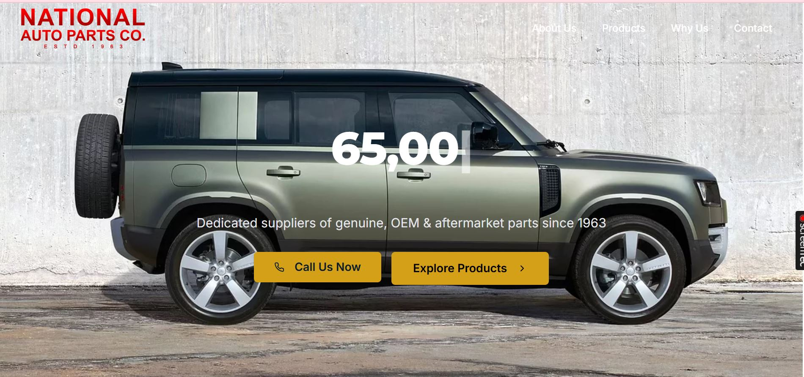
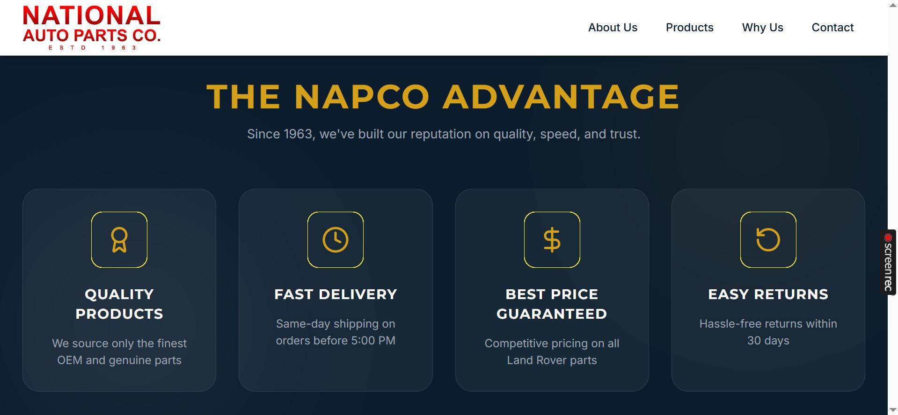
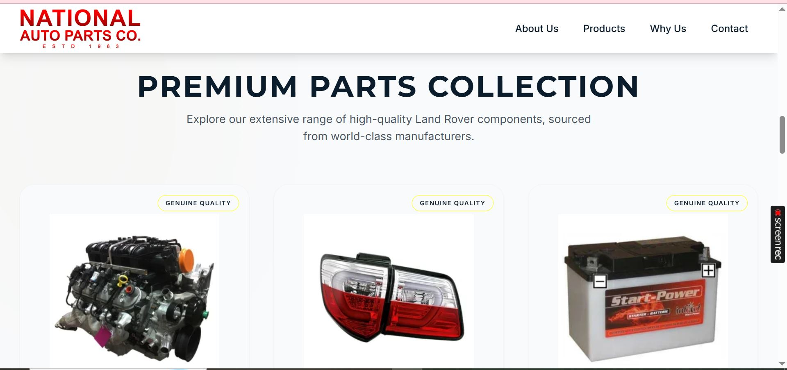
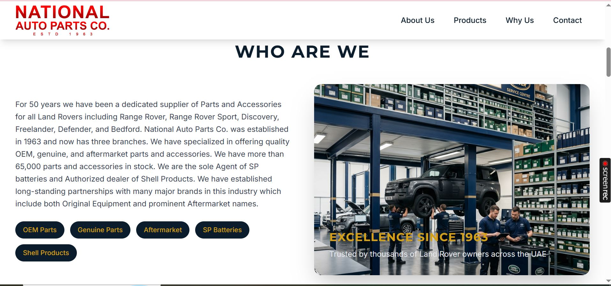
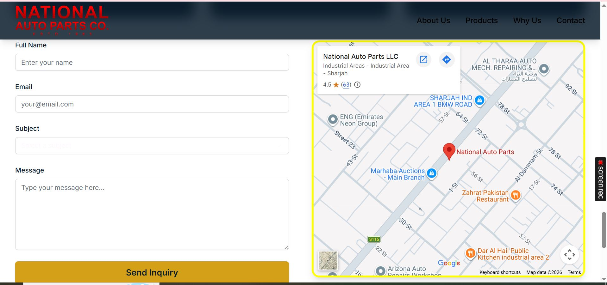

# National Auto Parts Co. (NAPCO) - Official Website

This is the official web application for **National Auto Parts Co. (NAPCO)**, a dedicated supplier of genuine, OEM, and aftermarket Land Rover parts and accessories in the UAE since 1963.

## 🔗 Live Demo
Check out the live website here: [https://deepskyblue-spider-361301.hostingersite.com/](https://deepskyblue-spider-361301.hostingersite.com/)

---

## 📸 Screenshots

### Home Page - Hero Section


### The NAPCO Advantage


### Premium Parts Collection


### About Us


### Contact & Location


---

## 🚀 Features
- **Land Rover Specialist:** Extensive range of components for Range Rover, Defender, Discovery, and more.
- **Genuine Quality:** Authorized dealer of SP Batteries and Shell Products.
- **Premium Experience:** Modern, responsive design for a seamless user experience.
- **Customer First:** Features like Same-day shipping, Easy returns, and Best price guarantee.
- **Interactive Maps:** Easy navigation to our branches in Sharjah and across UAE.

## 🛠️ Technologies Used
- **Frontend:** React.js, Tailwind CSS
- **Build Tool:** Vite
- **UI Components:** Shadcn UI


## 📂 Project Structure
```text
apps/
  └── web/          # Main React application
      ├── src/      # Components, Pages, Hooks, and Logic
      ├── public/   # Static assets (images, icons)
      └── ...
```

## 📦 Getting Started

1. **Clone the repository:**
   ```bash
   git clone https://github.com/national-auto-parts.git
   ```

2. **Install dependencies:**
   ```bash
   npm install
   ```

3. **Run the development server:**
   ```bash
   npm run dev
   ```

---

## 📞 Contact Information
- **Location:** Industrial Area, Sharjah, UAE
- **Website:** [www.nationalautoparts.ae](http://www.nationalautoparts.ae)
- **Established:** 1963

---
*Created with ❤️ for National Auto Parts Co.*
